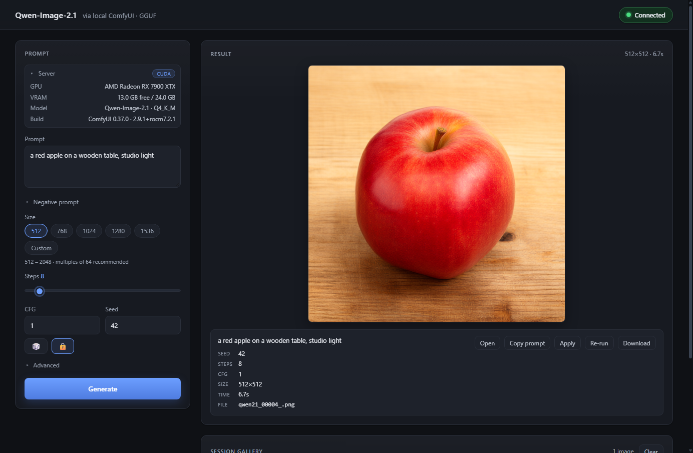
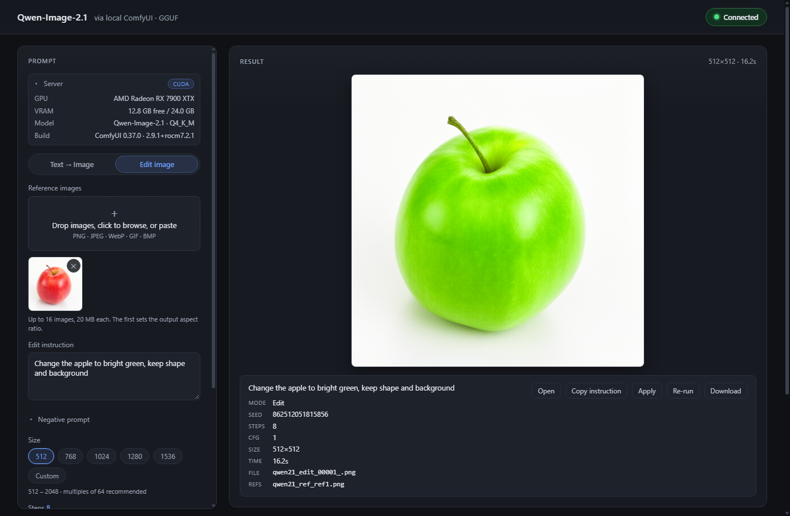
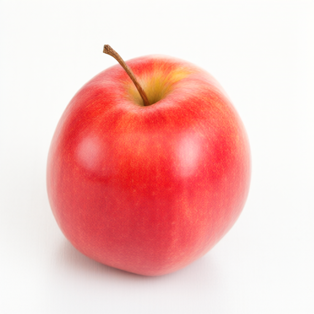
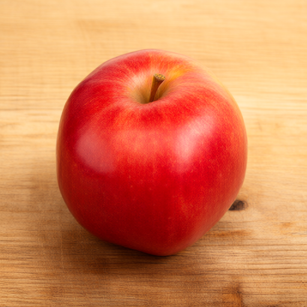
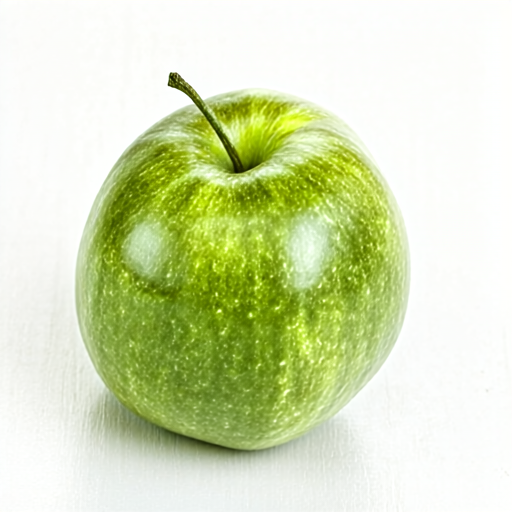

# Qwen-Image-2.1 Playground

Local image generation with [Qwen-Image-2.1](https://github.com/QwenLM/Qwen-Image-2.1) (7B DiT, unified text→image and image edit, native text rendering and RGBA) via **ComfyUI**, driven by a dependency-free web UI for **macOS (Apple Silicon)** and **Windows 11 (AMD ROCm)**.

> A cozy bookshop cafe at golden hour, sunlight streaming through tall windows, a cat sleeping on a stack of books, a chalkboard sign that reads "QWEN IMAGE 2.1" — 1024×1024, 40 steps, ~550 s on an M4 Pro (first run, models loaded from disk).

## What's inside

| Path | Purpose |
|---|---|
| `app/` | Web UI (vanilla HTML/CSS/ES modules, no build step) — talks to ComfyUI's HTTP + WebSocket API |
| `scripts/` | macOS setup & start scripts |
| `docs/` | Platform guides: [macOS](docs/MACOS.md) · [Windows 11 + AMD 7900 XTX](docs/WINDOWS_AMD.md) |
| `docs/workflow_t2i_comfyui_template.json` | Official ComfyUI T2I workflow template |

## Quick start

1. Install + download weights (~11 GB):
   - **macOS:** `./scripts/setup_mac.sh` — full guide: [docs/MACOS.md](docs/MACOS.md)
   - **Windows 11 + RX 7900 XTX:** official ComfyUI Desktop or portable (AMD ROCm auto-selected) — full guide: [docs/WINDOWS_AMD.md](docs/WINDOWS_AMD.md)
2. Start ComfyUI on port 8188 with CORS scoped to the UI origin (macOS:
   `./scripts/start_comfyui_mac.sh`; Windows:
   `python main.py --port 8188 --use-pytorch-cross-attention --enable-cors-header http://127.0.0.1:8080`).
   The UI is served from a different origin, so CORS is required — pass the exact
   origin you serve the UI from (`http://127.0.0.1:8080` by default; use `:8137`
   if you start the server with `--port 8137`). A bare `--enable-cors-header`
   answers `Access-Control-Allow-Origin: *`, which lets any website you visit read
   ComfyUI's files (including uploaded inputs).
3. Serve `app/` over http and open it, e.g. `python scripts/serve_app.py`,
   then browse to `http://127.0.0.1:8080`. The server sends
   `Cache-Control: no-store`, so HTML, CSS and ES modules are always fresh (no
   new-HTML + stale-stylesheet mismatch). Generate with ⌘/Ctrl+Enter. The page
   validates node availability against the running server and shows ComfyUI
   errors verbatim.

> Using a plain `python -m http.server` instead sends no cache headers, so a
> hard reload (Ctrl/Cmd+Shift+R) may be needed — browsers heuristically cache
> `styles.css` and ES modules.

> **Verified on Windows + ROCm:** first real GPU generation on an **RX 7900 XTX
> 24 GB** (Windows 11, torch 2.9.1+rocm7.2.1, ComfyUI 0.37.0, Python 3.12.3) —
> 512×512, 8 steps in ~18.1 s cold including ~14 s of one-time model loading
> (~0.6 s/step steady-state), no errors. Full details:
> [docs/WINDOWS_AMD.md](docs/WINDOWS_AMD.md). As noted above, the UI runs from a
> different origin, so CORS is required on the ComfyUI command line — scope it
> with `--enable-cors-header http://127.0.0.1:8080`.

## Playground UI

Dependency-free (vanilla HTML/CSS/ES modules), dark theme, responsive:

- Two modes: **Text → Image** and **Edit image**
- **Image edit**: drag & drop / click-to-browse / Ctrl·⌘+V paste one or more
  reference images, an edit instruction, and the same size / steps / CFG / seed /
  advanced controls. References upload to ComfyUI (`POST /upload/image`) and feed
  `TextEncodeQwenImage21` via its autogrow `images` inputs (the node's own
  `latent` output seeds the sampler); results keep the mode + references in their
  metadata so **Apply / Re-run** restores the edit.
- Live **server panel**: GPU name, free/total VRAM, ComfyUI + PyTorch version
- Prompt + collapsible negative prompt; size presets or custom W/H; steps, CFG,
  seed with lock and randomize
- **Advanced** sampler / scheduler / denoise / batch controls, populated from the
  server's `/object_info` enums (euler + simple by default for Qwen-Image-2.1)
- Step counter, **ETA**, monotonic progress bar, live queue position; cancel a
  running *or* still-queued job
- Result viewer with **Open / Copy prompt / Apply / Re-run / Download** actions
- Session **gallery** with lazy WebP thumbnails, per-image delete and clear
- Reconciles with the live queue on reload: flags a job still running on the GPU
  (with a stop button) and recovers its result
- Accessible: ARIA live regions, focus-visible rings, `prefers-reduced-motion`

### Image editing

Upload a reference (drag & drop, click, or paste), describe the change, and the
edit follows the instruction. The example turns a red apple green —
512×512, 8 steps, 16.2 s on the RX 7900 XTX.

## Which quant fits your machine

| Hardware | DiT | Text encoder | Peak memory |
|---|---|---|---|
| Mac 24–48 GB unified | GGUF `Q4_K_M` (4.2 GB) | `qwen3vl_8b_w4a8` (6.3 GB) | ~14 GB |
| Mac 64 GB+ unified | GGUF `Q8_0` (7.6 GB) | `w4a8` / `int8_convrot` | ~18 GB |
| 7900 XTX 24 GB | GGUF `Q6_K` (5.9 GB) | `qwen3vl_8b_w4a8` | ~12–14 GB |

## Results

All runs use euler / simple / cfg 1.0 (FLUX-style), negative prompt empty.

| # | Image | Prompt | Size | Steps | Hardware | Backend | Seed | Total time |
|---|---|---|---|---|---|---|---|---|
| 1 |  | a red apple | 512×512 | 8 | M4 Pro, 48 GB | MPS, GGUF Q4_K_M | 42 | ~116 s (incl. first model load) |
| 2 | (graph validation render, not archived) | an orange cat sitting on a yellow bookshelf | 512×512 | 8 | M4 Pro, 48 GB | MPS, GGUF Q4_K_M | 42 | ~56 s |
| 3 |  | cozy bookshop cafe…chalkboard reads "QWEN IMAGE 2.1" | 1024×1024 | 40 | M4 Pro, 48 GB | MPS, GGUF Q4_K_M | 7 | ~550 s (≈13.5 s/step) |
| 4 |  | a red apple on a wooden table, studio light | 512×512 | 8 | RX 7900 XTX, 24 GB | ROCm 7.2.1, GGUF Q4_K_M | 42 | ~18.1 s (incl. ~14 s first model load; ~0.6 s/step steady-state) |
| 5 |  | **edit** — "Change the apple to bright green, keep shape and background" (reference: red apple) | 512×512 | 8 | RX 7900 XTX, 24 GB | ROCm 7.2.1, GGUF Q4_K_M | 42 | ~16.2 s warm (image upload + reference latents) |

Main output, full size:

## License note

The playground code in this repository is released under the **MIT License** — see [LICENSE](LICENSE).

Qwen-Image-2.1 is released under the **Qwen Research License** — non-commercial use only unless you obtain a separate commercial license from Alibaba.

## Security notes

- ComfyUI listens only on `127.0.0.1:8188`; slots are looked up via the app's `POST /prompt`/`/interrupt` rather than trusting the client UI.
- The UI is served from a different origin, so ComfyUI must be started with CORS **scoped to that origin** — `--enable-cors-header http://127.0.0.1:8080` — not the bare flag, which answers `Access-Control-Allow-Origin: *` and lets any website you visit read ComfyUI's files (including uploaded inputs) and queue jobs. Keep ComfyUI bound to `127.0.0.1`.
- **Uploads:** raster images only (PNG/JPEG/WebP/GIF/BMP), ≤20 MB each, validated client-side. Each upload is renamed to a random `qwen21_ref_<id>.<ext>` (never the user's filename) and sent with `overwrite=false`, so it cannot clobber an existing input file or traverse paths. Previews use `blob:` object URLs / ComfyUI's `/view` in an `` only — never `iframe`/`object`/HTML.
- The web UI is fully offline: no external assets; never uses `innerHTML`/eval for server- or user-derived data; a strict CSP meta policy restricts `connect-src`/`img-src` to localhost:8188 (`+ blob:`/`data:` for local previews) and sets `object-src 'none'`/`base-uri 'self'`; `fetch`/`WS` requests use `AbortController` with reconnection backoff.
